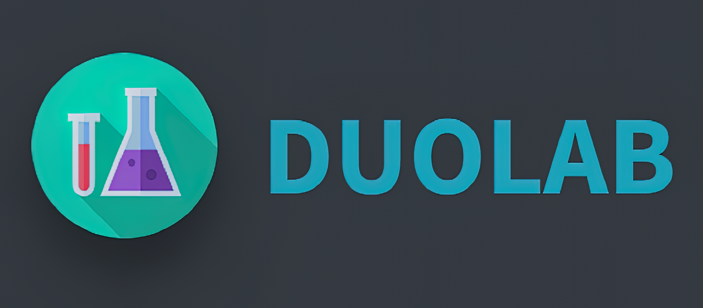
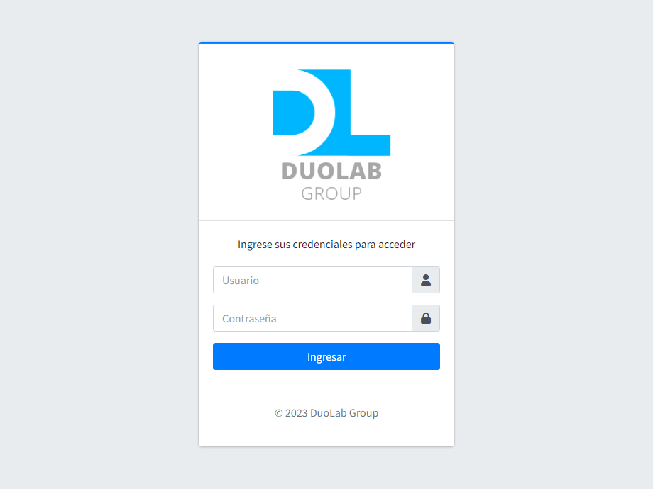
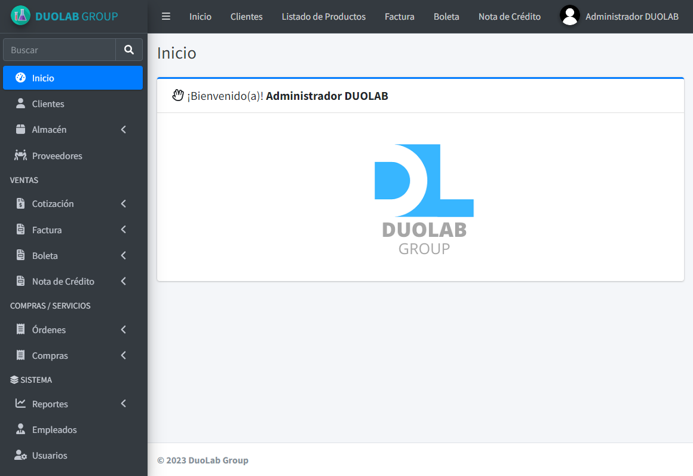
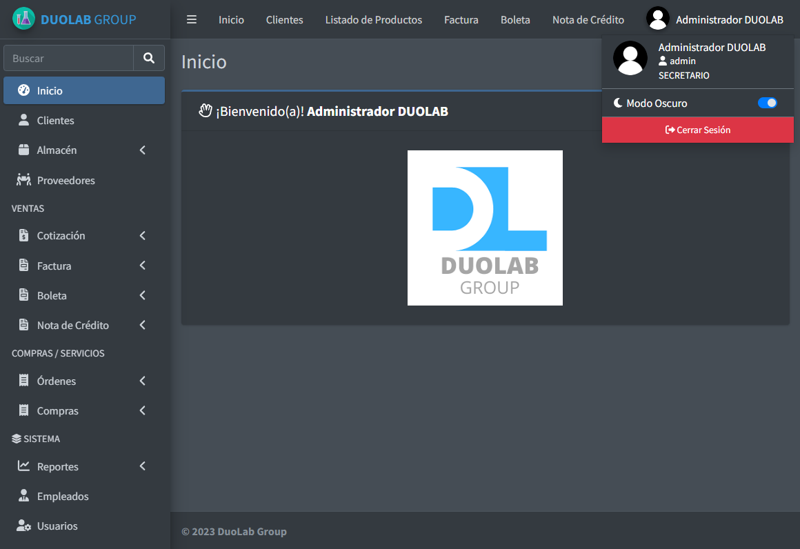
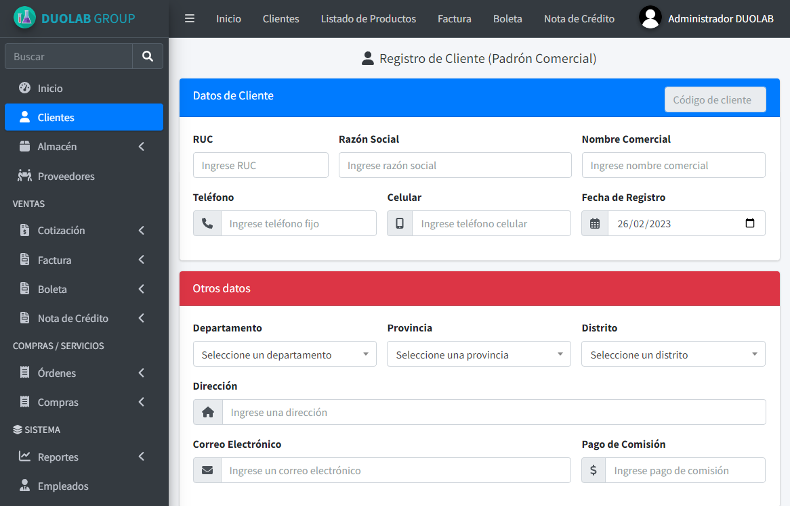
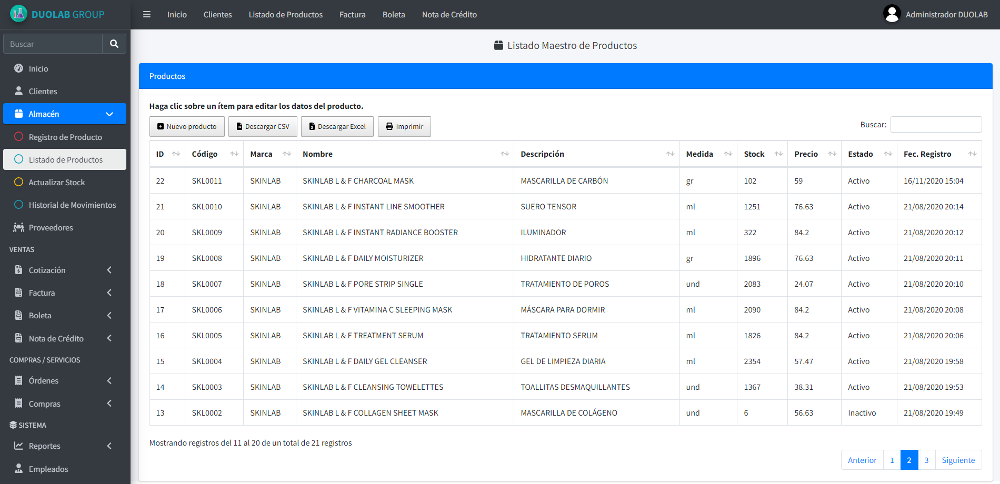
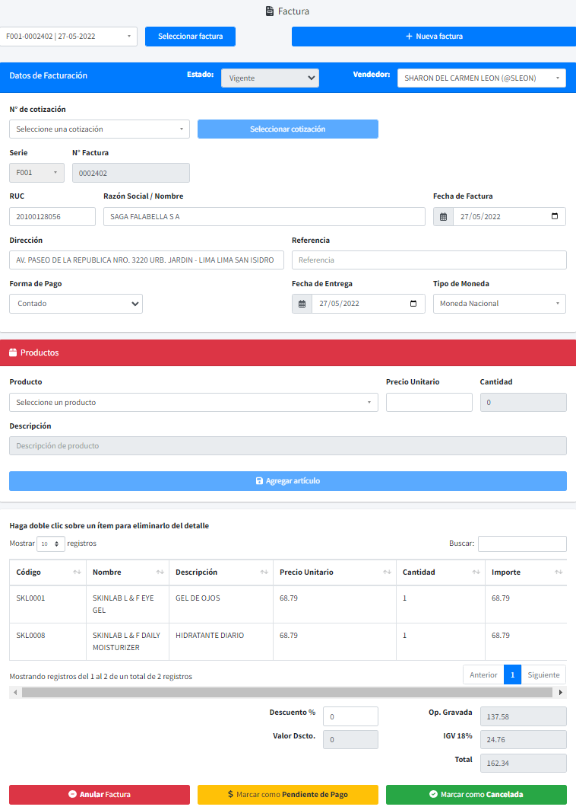
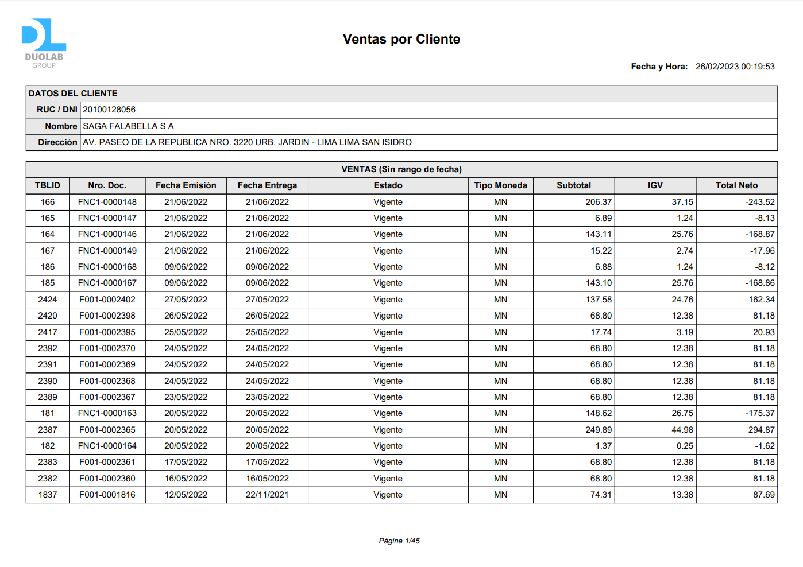
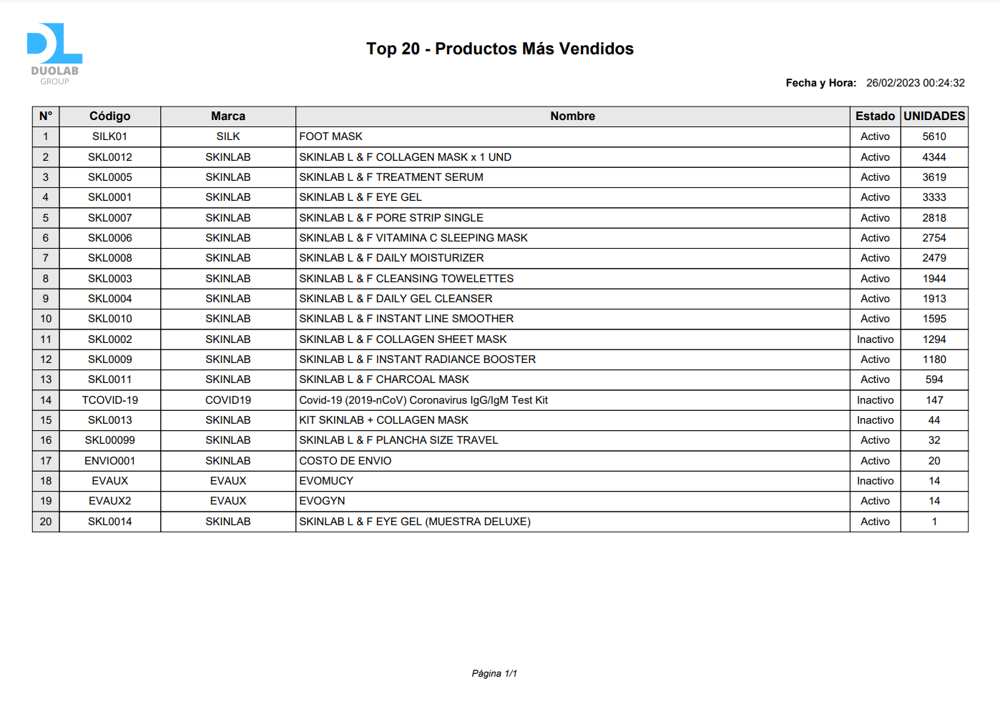
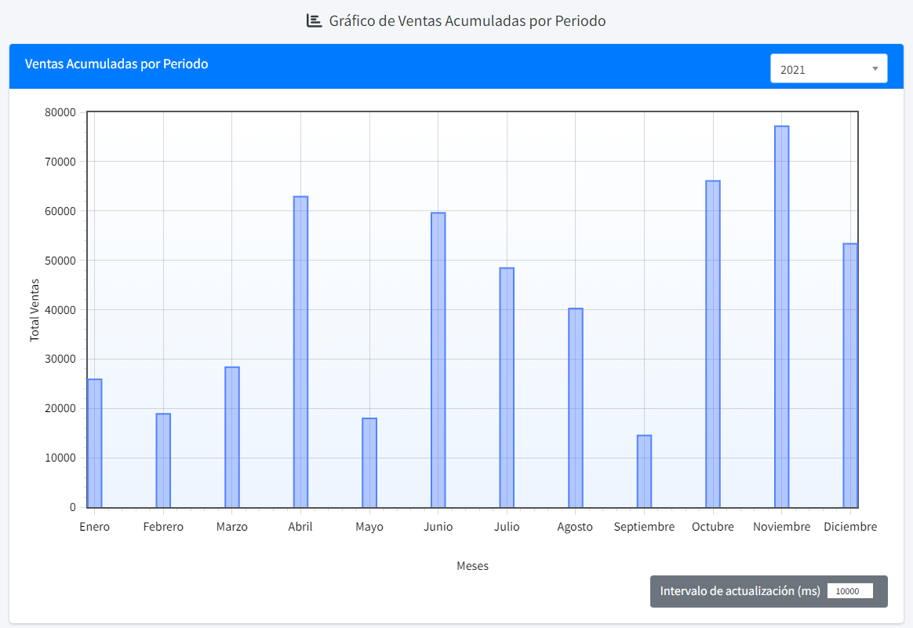

# 
**DUOLAB** es un modesto **sistema web** para gestión de clientes, productos, ventas y más...
Escrito utilizando **PHP** y **JavaScript**.

## Módulos disponibles
- Clientes
- Almacén (Maestro de Productos, Registro e Historial de Movimientos)
- Ventas (Cotización, Factura, Boleta, Nota de Crédito)
- Compras / Servicios (Orden de Compra, Orden de Servicio, Compra Interna)
- Proveedores
- Empleados
- Usuarios (Registro y Gestión de Accesos)
- Reportes (Clientes, Productos, Ventas, Gastos)

## Capturas

## Dependencias
- [AdminLTE](https://github.com/ColorlibHQ/AdminLTE)
- [jQuery](https://github.com/jquery/jquery)
- [DataTables](https://github.com/DataTables/DataTablesSrc)
- [Select2](https://github.com/select2/select2)
- [FPDF](http://www.fpdf.org)
- [Notify.js](https://github.com/jpillora/notifyjs)
